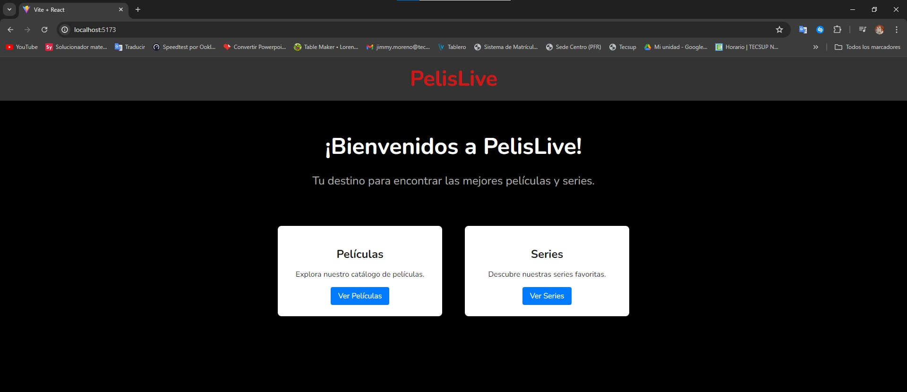
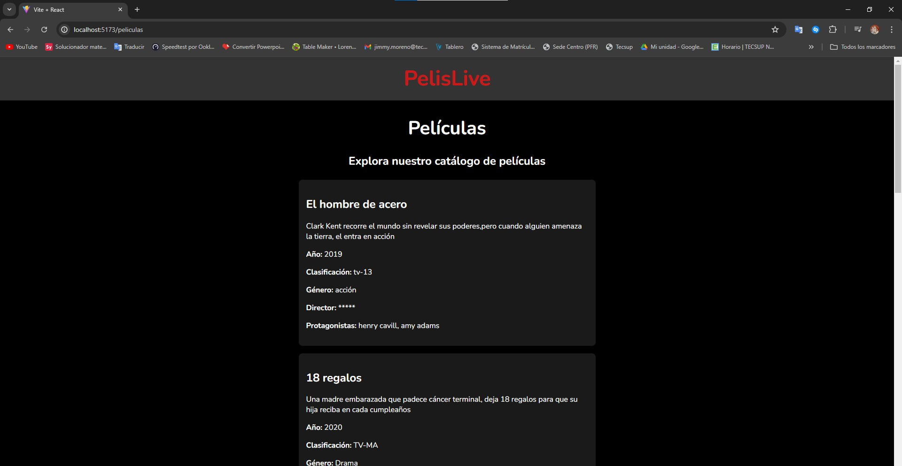
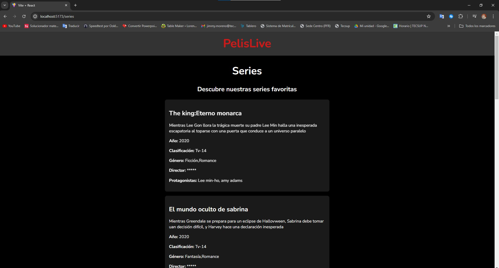

# PelisLive

## Descripción del Proyecto
App web desarrollada con React y Vite, diseñada para ofrecer una interfaz intuitiva y atractiva para explorar un catálogo de películas y series. La aplicación consume datos de un archivo JSON ubicado en el directorio principal del proyecto y los presenta de manera dinámica a los usuarios.

## Estructura del Proyecto
El proyecto está estructurado en componentes React, organizados para mantener el código limpio y modular. Las páginas principales son:

- **Home**: Página de inicio con un título atractivo y botones para navegar a las secciones de películas y series.
- **Películas**: Página dedicada a mostrar la lista de películas.
- **Series**: Página dedicada a mostrar la lista de series.

## Pasos Realizados

1. **Configuración Inicial**:
   - Creación del proyecto con Vite y React.
   - Instalación de las dependencias necesarias, como `react-router-dom` para manejar el enrutamiento.

2. **Estructura del Proyecto**:
   - Se crearon los componentes `Navbar`, `Home`, `Peliculas` y `Series`.
   - Configuración del enrutamiento en `App.jsx` para navegar entre las páginas.

3. **Página Principal (Home)**:
   - Se implementó un `Navbar` centrado con el título "PelisLive".
   - Se diseñó una página principal con un `h1` y un `h3` centrados, y dos cards con botones para redirigir a las secciones de películas y series.

4. **Carga Dinámica de Datos**:
   - Se configuraron los componentes `Peliculas` y `Series` para cargar datos dinámicamente desde el archivo JSON.
   - Se mostraron los datos en una lista de tarjetas estilizadas.

## Capturas de Pantalla

### Página Principal (Home)

### Página de Películas

### Página de Series

